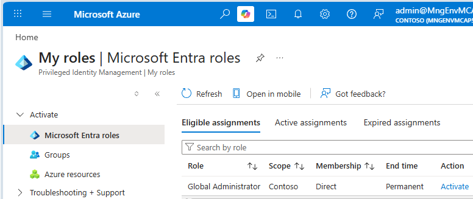

# extract-insight-action

## What This Application Does

extract-insight-action is an email intelligence workflow that ingests mailbox messages, processes attachments, and turns content into searchable operational insight.

It uses:

- Azure Functions and Service Bus for orchestration
- Azure Content Understanding analyzers for document, image, audio, and video extraction
- Cosmos DB for persistence
- A Spring Boot web app for secure user review and actions
- AI agents for triage and decision support

## Deployment And Operations Runbook (PowerShell)

This runbook covers setup, deployment, code push, code deployment, and app run/validation.

## 1. Prerequisites

Install and verify:

- Azure CLI
- PowerShell (supported versions):
	- Windows PowerShell 5.1 (Desktop edition)
	- PowerShell 7.x (Core edition)
	- Scripts in this repository are tested to work in both environments.
- Java 21 JDK (JAVA_HOME must point to Java 21)
- Maven (mvn on PATH)

Recommended permissions for first-time environment setup:

- Contributor (or Owner) on target Azure subscription
- Entra Application Administrator (or higher)
- Entra Privileged Role Administrator or Global Administrator for admin consent and role operations

If your tenant uses PIM, activate roles before deployment. You can find your role and activate Global Administrator role for 4 hours, here: 
https://portal.azure.com/?feature.msaljs=true#view/Microsoft_Azure_PIMCommon/ActivationMenuBlade/~/aadmigratedroles/provider/aadroles



## 2. Open The Repo And Sign In

```powershell
cd C:\path\to\extract-insight-action
az login
az account set --subscription <your-subscription-id>
az account show --query "{name:name,id:id,tenantId:tenantId}" -o json
```

## 3. Pick Environment And Suffix

Choose an environment (for example dev) and a short suffix such as 1. Use the same values for all deployment scripts.

Example deployment key: eia-dev-1

## 4. Deploy Infrastructure

Run:

```powershell
.\deployment\1.deploy-infrastructure.ps1 -Environment dev -Suffix 1
```

If you omit `-Environment` or `-Suffix`, the script prompts for them. The deployment scripts still prompt for location unless you accept the default shown in the prompt. It then creates core resources and writes env.bat at the repo root with AZURE_KEY_VAULT_URL.

## 5. Complete Platform Setup

Run in order:

```powershell
.\deployment\2.grant-graph-consent.ps1 -Environment dev -Suffix 1
.\deployment\3.deploy-agents.ps1 -Environment dev -Suffix 1
.\deployment\4.content-understanding-add-schema.ps1 -Environment dev -Suffix 1
```

## 6. Build And Deploy Application Code

Run:

```powershell
.\deployment\5.deploy-code.ps1 -Environment dev -Suffix 1
```

Select workloads when prompted (All for first deployment, or only the component you changed).

Then choose the environment posture (run last, after everything is deployed):

```powershell
# Dev: open access + grant the signed-in user data-plane RBAC for local testing
.\deployment\6.operation-dev.ps1 -Environment dev -Suffix 1

# Prod: harden the network (private endpoints, disable public access)
.\deployment\6.operation-prod.ps1 -Environment prod -Suffix 1
```

If the environment is already hardened with `6.operation-prod.ps1`, use the
secure deployment window wrapper for code redeploys from your laptop:

```powershell
.\deployment\5.deploy-code-secure-window.ps1 -Environment prod -Suffix 1
```

The wrapper temporarily applies the approved exception controls, runs
`5.deploy-code.ps1`, then automatically removes temporary rules/tags.

`6.operation-prod` prompts **"Allow local testing access?"**: answer **yes** to
temporarily allow your current public IP through the firewalls and grant your
signed-in user the data-plane RBAC (Storage, Key Vault, Cosmos DB, Cognitive
Services) needed to test against the hardened resources; answer **no** to remove
that access and keep everything fully private. To undo all hardening, re-run it
with `-Rollback` (see Utilities below).

## 7. Onboard Users

Run:

```powershell
.\deployment\110.admin-user-access.ps1 -Environment dev -Suffix 1
```

This configures access groups and user profile metadata for the web app.

## 8. Push Code Changes

After local code changes:

```powershell
git status
git add .
git commit -m "<your message>"
git push
```

Then redeploy changed workloads:

```powershell
.\deployment\5.deploy-code.ps1 -Environment dev -Suffix 1
```

For hardened prod environments, use:

```powershell
.\deployment\5.deploy-code-secure-window.ps1 -Environment prod -Suffix 1
```

## 9. Run The App Locally

For local validation, use:

```powershell
.\deployment\1000.local-deploy.ps1
```

Optional debug mode for a single selected function app:

```powershell
.\deployment\1000.local-deploy.ps1 -Debug
```

If needed, explicitly pass Key Vault URL:

```powershell
.\deployment\1000.local-deploy.ps1 -KeyVaultUrl https://<your-vault>.vault.azure.net
```

## 10. Recommended First-Time Script Order

1. deployment/1.deploy-infrastructure.ps1
2. deployment/2.grant-graph-consent.ps1
3. deployment/3.deploy-agents.ps1
4. deployment/4.content-understanding-add-schema.ps1
5. deployment/5.deploy-code.ps1
6. deployment/6.operation-dev.ps1 (or 6.operation-prod.ps1 to harden for prod — run last)
7. deployment/110.admin-user-access.ps1

After step 6 hardens prod, use `deployment/5.deploy-code-secure-window.ps1`
for subsequent code deployments into that hardened environment.

## 11. Utilities

Rotate Graph secret:

```powershell
.\deployment\rotate-graph-api-secret.ps1 -Environment dev -Suffix 1
```

Undo prod hardening (delete VNet/private endpoints/DNS, re-enable public access,
remove VNet integration; RBAC left untouched):

```powershell
.\deployment\6.operation-prod.ps1 -Environment prod -Suffix 1 -Rollback
```

Delete all deployed resources (destructive):

```powershell
.\deployment\100.admin-delete-all.ps1 -Environment dev -Suffix 1
```

Deploy code into an already hardened prod environment (temporary secure window,
automatic cleanup):

```powershell
.\deployment\5.deploy-code-secure-window.ps1 -Environment prod -Suffix 1
```
## 12. Scale and service limits

The solution supports horizontal scale for email intake, ingestion, and extraction.
At higher throughput, capacity is primarily constrained by service quotas and API limits.

### Service limits summary

| Service | Throughput / API limit | Max attachment or file size | Max message size |
|---|---|---|---|
| Microsoft Graph (Mailbox API) | ~60,000 requests/hour (per app + mailbox) | 150 MB | Exchange limit applies (150 MB) |
| Azure Content Understanding | 180,000 operations/hour | 200 MB | N/A |
| Microsoft 365 Exchange Online (Mailbox) | 3,600 received emails/hour | 150 MB attachment | 150 MB total message |

### Practical scaling notes

- **Primary bottlenecks**
	- Microsoft Graph and Exchange throttling are typically the first limits reached in mailbox-heavy workloads.

- **Scale-out strategy**
	- Azure Content Understanding can be scaled horizontally by deploying multiple analyzer instances.
	- Split mailbox processing across workers/queues to keep throughput stable under burst load.

- **Quota flexibility**
	- Some limits are soft quotas and can be increased through Microsoft support requests.

- **Exchange message size behavior**
	- Default mailbox limits are 35 MB for sending and 36 MB for receiving.
	- Administrators can configure a custom message limit from 1 MB up to 150 MB.
	- Internal Microsoft-to-Microsoft mail flow supports up to 150 MB total message size.
	- Mail routed outside Microsoft datacenters may incur about 33% encoding overhead, reducing practical maximum size to about 112 MB.

### References

- Microsoft Graph throttling limits: https://learn.microsoft.com/en-us/graph/throttling-limits
- Microsoft Graph large attachments: https://learn.microsoft.com/en-us/graph/outlook-large-attachments
- Azure Content Understanding service limits: https://learn.microsoft.com/en-us/azure/ai-services/content-understanding/service-limits
- Exchange Online limits: https://learn.microsoft.com/en-us/office365/servicedescriptions/exchange-online-service-description/exchange-online-limits

## Notes

- Keep Suffix, Environment, and Location consistent across scripts for the same environment.